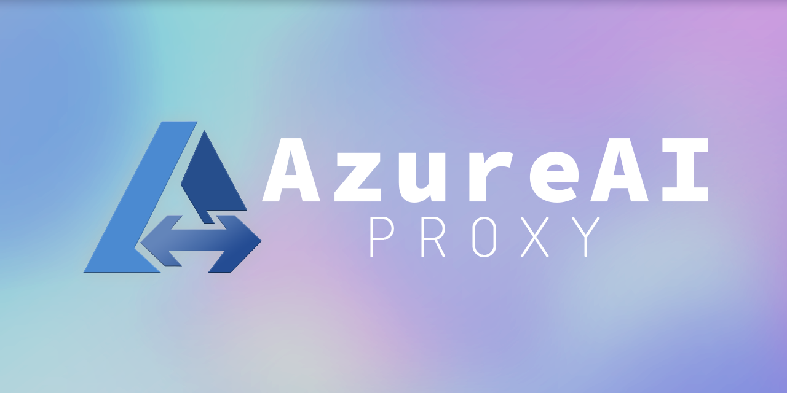

<div align=center>




README LANGUAGES [ [**English**](README.md) | [简体中文](README-zh.md) ]
</div>

# **Azure AI Proxy**


_**"A lightweight proxy that bridges Azure OpenAI API format to any LiteLLM-supported backend."**_

A lightweight, modular proxy that exposes an Azure OpenAI–compatible API and translates
requests into backend calls via [LiteLLM](https://docs.litellm.ai/docs/) — enabling you to use **DeepSeek**, **MIMO**,
**Anthropic**, **Ollama**, or any custom model through a unified Azure AI interface.

Compatible with tools and IDEs that support the Azure OpenAI API format, including JetBrains IDEs with GitHub Copilot.

## Features & Advantages

- **Full Azure AI Compatibility** — Supports `/openai/deployments`, `/openai/models`, chat completions, embeddings, and legacy completions.
- **Multi-Provider via LiteLLM** — Use any LiteLLM-supported provider (`openai/`, `deepseek/`, `anthropic/`, `ollama/`, etc.) with a unified config.
- **Model Identity Emulation** — Use `base_model` to impersonate known Azure models and fix context-window display issues.
- **Multi-Model Support** — Configure multiple backends in `config.yaml` and switch via JetBrains' deployment selector.
- **Enhanced Streaming** — SSE keepalive comments, per-chunk timeout protection, graceful client disconnect detection.
- **Tool Call Sanitization** — Automatically fixes malformed JSON in tool call arguments (e.g. unescaped Windows paths).
- **Graceful Error Handling** — Clean disconnection on client interrupt, Azure-format error responses, full LiteLLM exception mapping.
- **Debug Mode** — Toggle `general.debug` to log full request bodies for troubleshooting.
- **Access Control** — Set `general.api-key` to require an API key on all proxy requests.
- **Zero Dependencies Beyond pip** — Only `aiohttp`, `litellm`, and `pyyaml`.

## Quick Start

### 1. Prerequisites

- Python **3.10+**
- Windows, macOS, or Linux

### 2. Clone & Setup

```shell
git clone https://github.com/CarmJos/azure-ai-proxy
cd azure-ai-proxy
```

Then run the init script to create .venv and install dependencies,

for Windows:
```shell
init.bat
```

for macOS / Linux:
```shell
chmod +x init.sh
./init.sh
```

> [!CAUTION]  
> If the init script fails, please open it with a text editor and
> inspect the commands. The script is straightforward — each step is a single shell
> command you can also run manually.

### 3. Configure Models

Edit `config.yaml` to define your backend models:

```yaml
general:
  host: "0.0.0.0"
  port: 4000
  timeout: 120
  debug: false              # set true for request body logging
  api-key: ""               # optional — set to require an api-key header on all requests
  log-level: "INFO"         # DEBUG / INFO / WARNING / ERROR
  log-file: ""              # log file path (empty = stdout only)
  max-stream-timeout: 300   # max seconds between stream chunks before timeout
  keepalive-interval: 15    # seconds between SSE keepalive comments

models:
  - model_name: deepseek-v4-pro
    litellm_params:
      model: deepseek/deepseek-v4-pro
      api_base: https://api.deepseek.com
      api_key: sk-YOUR-KEY
      supports_function_calling: true
      supports_reasoning: true
      max_tokens: 384000
      max_input_tokens: 1000000
      max_output_tokens: 384000
      timeout: 180
```

See [`config.example.yaml`](config.example.yaml) for a full annotated example with multiple providers.

### 4. Run

**Windows:**

```shell
run.bat
```

**macOS / Linux:**

```shell
chmod +x run.sh
./run.sh
```

The proxy starts at `http://localhost:4000`.

### 5. Use with JetBrains IDE

> [!NOTE]
> The following steps show how to connect this proxy to **JetBrains GitHub Copilot**.
> Any client that speaks the Azure OpenAI API format will work similarly.

1. Open the **Copilot Chat** panel.
2. Click the model selector dropdown in the chat input area.
3. Choose **Manage Models**.
4. Under the **Azure** provider section, click **+ Add models**.
5. Fill in the form for each model:

| Field              | Value                                                                  |
|--------------------|------------------------------------------------------------------------|
| **Model ID**       | Exact deployment name from `config.yaml` (e.g. `deepseek-v4-pro`)      |
| **Deployment URL** | `http://{host}:{port}/openai/deployments/{model-id}/chat/completions`  |
| **API key**        | Any value — unless `general.api-key` is set, then must match that key. |
| **Model name**     | The display name you like.                                             |
| **Tool**           | **Check** (otherwise "agent" mode is not supported)                    |
| **Vision**         | **Uncheck** (unless your backend supports image inputs)                |

> [!TIP]
> **Deployment URL** must contain the same model ID as the **Model ID** field.  
> Replace `{model-id}` with your actual deployment name, e.g.
`http://localhost:4000/openai/deployments/deepseek-v4-pro/chat/completions`.

After adding, the model will appear in your Copilot Chat model selector.

## Configuration Reference

### `config.yaml`

#### General Settings

| Field                        | Type | Description                                                     |
|------------------------------|------|-----------------------------------------------------------------|
| `general.host`               | str  | Bind address (default: `0.0.0.0`)                               |
| `general.port`               | int  | Proxy listen port (default: `4000`)                              |
| `general.timeout`            | int  | Per-request timeout in seconds (default: `120`)                  |
| `general.debug`              | bool | Log full POST request bodies when `true`                         |
| `general.api-key`            | str  | Optional — require this `api-key` header on all requests         |
| `general.log-level`          | str  | Log level: `DEBUG` / `INFO` / `WARNING` / `ERROR` (default: `INFO`) |
| `general.log-file`           | str  | Log file path (empty = stdout only)                              |
| `general.max-stream-timeout` | int  | Max seconds between stream chunks before timeout (default: `300`) |
| `general.keepalive-interval` | int  | Seconds between SSE keepalive comments (default: `15`)           |

#### Model Settings

| Field                                      | Type | Description                                                      |
|--------------------------------------------|------|------------------------------------------------------------------|
| `models[].model_name`                      | str  | Deployment name shown in JetBrains                                |
| `models[].litellm_params.model`            | str  | LiteLLM model identifier (e.g. `deepseek/deepseek-v4-pro`)       |
| `models[].litellm_params.api_base`         | str  | Backend API base URL                                              |
| `models[].litellm_params.api_key`          | str  | API key (or `os.environ/VAR` for env reference)                   |
| `models[].litellm_params.base_model`       | str  | Optional — Azure model name to impersonate                        |
| `models[].litellm_params.max_input_tokens` | int  | Reported context window size                                      |
| `models[].litellm_params.timeout`          | int  | Per-model timeout override in seconds                             |

All `litellm_params` fields support LiteLLM's full parameter set (`temperature`, `supports_vision`,
`supports_function_calling`, `supports_reasoning`, `supports_tool_choice`, `extra_headers`, etc.).

See [LiteLLM Providers](https://docs.litellm.ai/docs/providers) for the full list of supported providers and models.

### CLI Arguments

```
python -m proxy.server --config config.yaml --port 4000 --host 0.0.0.0
```

| Flag       | Default       | Description              |
|------------|---------------|--------------------------|
| `--config` | `config.yaml` | Path to YAML config file |
| `--port`   | from config   | Override listen port     |
| `--host`   | from config   | Override bind address    |

## API Endpoints

| Method | Path                                            | Description                              |
|--------|-------------------------------------------------|------------------------------------------|
| `GET`  | `/openai/deployments`                           | List all configured deployments          |
| `GET`  | `/openai/deployments/{name}`                    | Single deployment detail                 |
| `GET`  | `/openai/deployments/{name}/models`             | Model info for a deployment              |
| `POST` | `/openai/deployments/{name}/chat/completions`   | Chat completions (stream and non-stream) |
| `POST` | `/openai/deployments/{name}/embeddings`         | Embeddings                               |
| `POST` | `/openai/deployments/{name}/completions`        | Legacy text completions                  |
| `GET`  | `/openai/models`                                | Azure model catalog                      |
| `GET`  | `/openai/models/{name}`                         | Single model detail (Azure format)       |
| `GET`  | `/v1/models`                                    | OpenAI-compatible model list             |
| `GET`  | `/v1/models/{name}`                             | Single model detail (OpenAI format)      |
| `GET`  | `/health`                                       | Health check                             |
| `GET`  | `/logs`                                         | Recent log buffer (last 200 lines)       |

## Project Structure

```
proxy/
├── server.py           # Application factory and entry point
├── config.py           # Configuration loading and management
├── bridge.py           # LiteLLM bridge — translates requests and normalizes responses
├── models.py           # Data models for parsed requests
├── routes.py           # Route registration
├── middleware.py        # Auth, logging, CORS, error handling middleware
├── azure_format.py     # Azure-format response builders and SSE formatting
├── logging_setup.py    # Logging configuration
├── utils.py            # Utility functions (JSON sanitization, etc.)
└── handlers/
    ├── chat.py         # Chat completions handler
    ├── embeddings.py   # Embeddings handler
    ├── completions.py  # Legacy completions handler
    ├── models.py       # Model listing handlers
    ├── deployments.py  # Deployment listing handlers
    └── health.py       # Health check and catch-all handlers
```

## Support and Donation

If you appreciate this plugin, consider supporting me with a donation at 
[GitHub Sponsors](https://github.com/sponsors/CarmJos) or
[爱发电](https://www.ifdian.net/a/carmjos/plan) !

**Thank you for supporting open-source projects!**

Many thanks to JetBrains for kindly providing a license for us to work on this and other open-source projects.

[](https://www.jetbrains.com/?from=https://github.com/CarmJos/)

## Open Source License

This project's source code is licensed under
the [GNU General Public License, Version 3](https://www.gnu.org/licenses/gpl-3.0.html).
